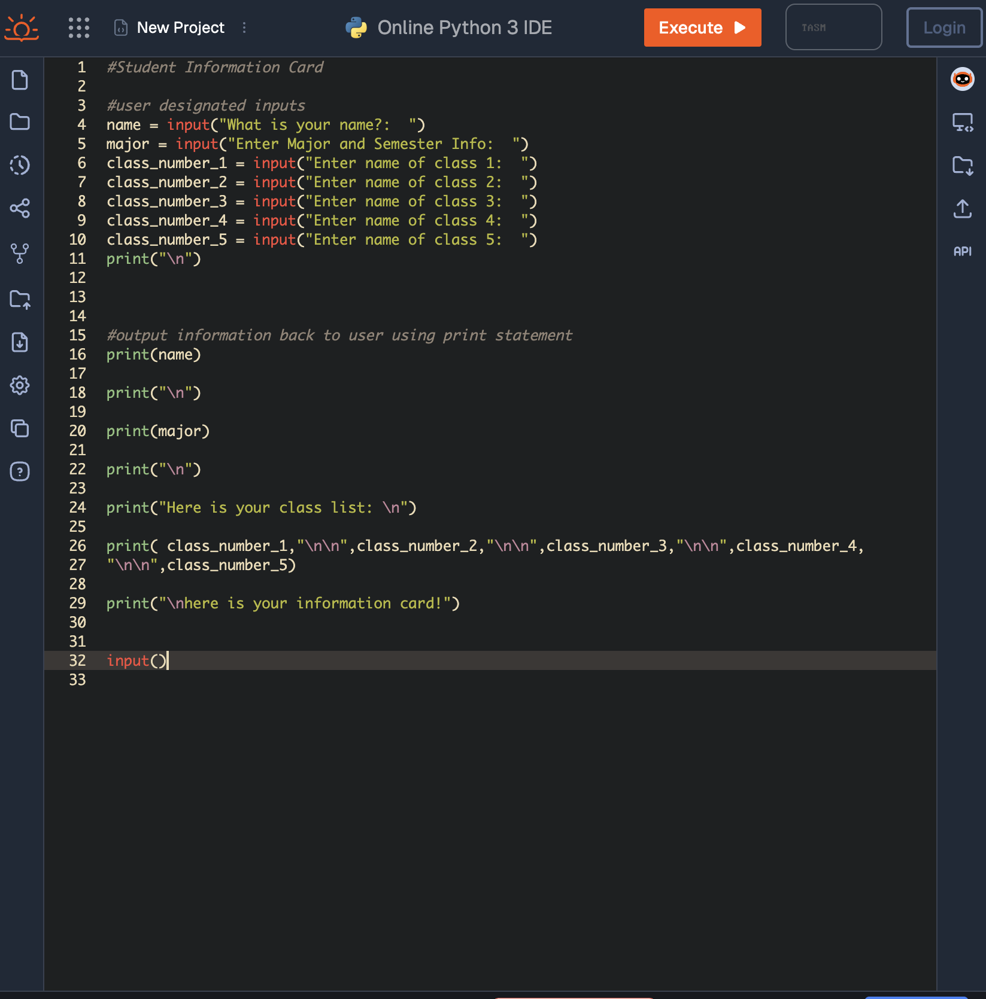
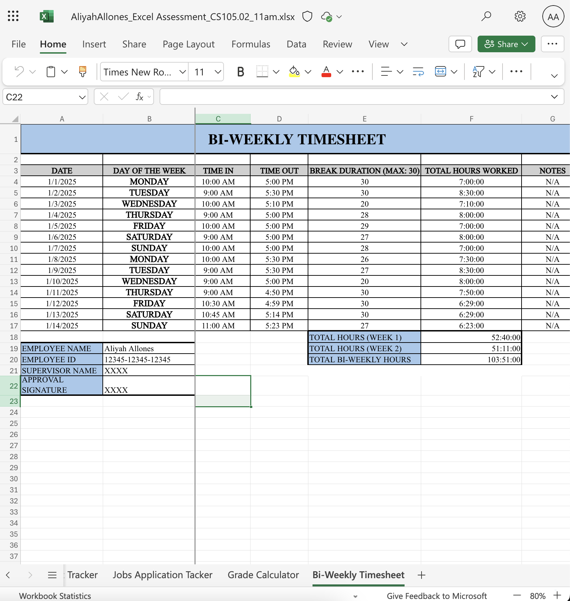

# Aliyah Allones
## Data Science Technician
Contact Info: alallones@loyola.edu 443-929-0007
### About Me 
Hello! I am a student at Loyola University Maryland with a major in Digital Health & Data Analytics. I am a intermediate Computer science professional with over 2 years of proven expertise in CS and Microsoft 365. 

With skills in programming, data analytics, Excel, and Python, I am able to Learn more about computer science & data analytics, and achieve knowledge and experience. I am adept at using Git/Github, Microsoft Access/Excel, and OnlineGDB. 

My varying skill set, commitment to learning, and passion for using said experience for searching career options makes me as a valuable asset.  In my spare time, I like to learn about video game designs and drawing digital art for clubs/organizations. 

You can find me on:
- [Linkedin](linkedin.com/in/aliyah-allones-231652261)
- [Handshake](https://app.joinhandshake.com/profiles/bzwkqx)
- [Instagram](https://www.instagram.com/aliyahallones__/)

### Education 
Loyola University Maryland Undergraduate Student. Class of 2027 majoring in BIOHEALTH: digital health and data analytics, GPA average of 3.3 and currently a Sophmore rising junior. In 2 organizational clubs, both having a role in executive board member as Social Media/PR Director. 

### Projects

## Access Database: Student Grades and Transcripts
#### Summary:
 - For this project, I created a Microsoft Access database to manage student academic records. I designed a table to store student information, including first name, last name, mailing address, student ID, course codes, course names, semesters, and overall grades.
I built queries to organize and filter the data, making it easier to find specific student records, semester & overall GPA's, and generate a detailed manuscript for specific students.
In this image of my projecr, I created transcript reports for two students. Each transcript includes course details, semester GPA, and overall GPA. The reports were exported as PDFs.
 - 

#### Project Report:

 Initial project idea: 
- How did you come up with this project? What problem did you set out to solve, and why was it a problem that needed to be solved? 
    - This project was an assingmeent from my CS105 class where we learned how to use Access in order to build projects. The problem that i set out to solve was to make a access database where potential administrations can use an access database to create transcripts for students. 

Tools I used: 
- What tools did you use in completing this project? 
    - I used Microsoft Access, google, and excel. I used Access as the main software in making my queries and relationships. i used google to answer any questions i might have about acess that i need help on. And lastly, i used Excel as a .csv file to input my tables into the fields in Access. 

Challenges I faced:
- What challenges did you face, and how? What obstacles did you overcome? 
    - I had trouble with the formatting of the transcript. Using form wizard was harder to do than I originally thought. I watched youtube tutorials online to aid me in fixing up my transcript, and made sure that all the information was correct. 

Other Resources: 
    - I mainly used YouTube as it had very helpful guides to guide me through with using form wizard, making queries, building relationships, etc. 

Result:
- What did you set out to achieve? Did you achieve it? What improvements would you like to make if you had a chance to take this further? 
    - I set out to achieve a fully working access transcript where i could put all nessecary queries into one page. if i had more time on this assignment, I would create another page with an average calculator on how well a student does in each class and which classes they need more work on. 

#### Project 2 Title
- Project 2 Summary
- 
- Project 2 Report

#### Project 3 Title
 - Project 3 Summary
- 
 - Project 3 Report

