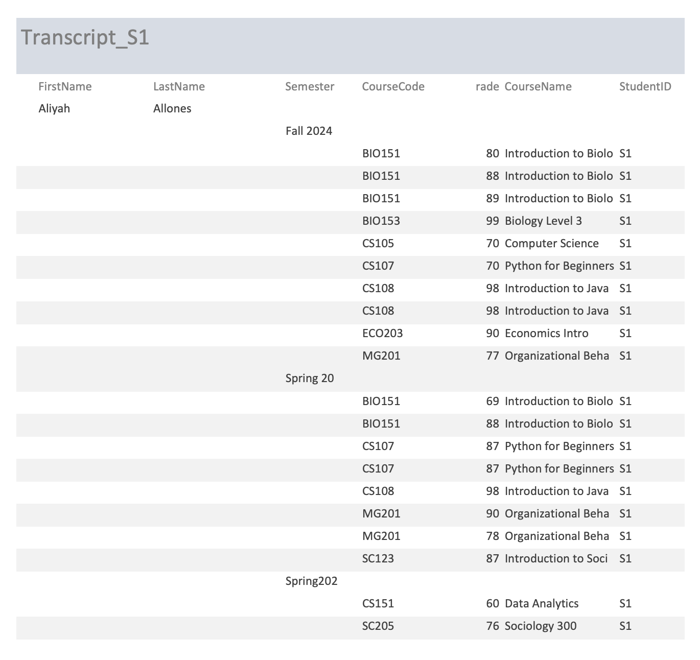

# Aliyah Allones
Contact Info: [fill in]
### About Me 
Hello! I am a student at Loyola University Maryland with a major in Digital Health & Data Analytics. I am a intermediate Computer science professional with over 2 years of proven expertise in CS and Microsoft 365. 

With skills in programming, data analytics, Excel, and Python, I am able to Learn more about computer science & data analytics, and achieve knowledge and experience. I am adept at using Git/Github, Microsoft Access/Excel, and OnlineGDB. 

My varying skill set, commitment to learning, and passion for using said experience for searching career options makes me as a valuable asset.  In my spare time, I like to learn about video game designs and drawing digital art for clubs/organizations. 

You can find me on Linkedin: linkedin.com/in/aliyah-allones-231652261, Handshake: https://app.joinhandshake.com/profiles/bzwkqx or Instagram: https://www.instagram.com/aliyahallones__/

### Education 
[Fill in Education here]
***

### Projects

#### Access Database: Student Grades and Transcripts
#### Summary:
 - For this project, I created a Microsoft Access database to manage student academic records. I designed a table to store student information, including first name, last name, mailing address, student ID, course codes, course names, semesters, and overall grades.
I built queries to organize and filter the data, making it easier to find specific student records, semester & overall GPA's, and generate a detailed manuscript for specific students.
In this image of my projecr, I created transcript reports for two students. Each transcript includes course details, semester GPA, and overall GPA. The reports were exported as PDFs.
 - 
 #### Project Report:
 - Initial project idea: 
#### How did you come up with this project? What problem did you set out to solve, and why was it a problem that needed to be solved? 

#### Tools I used: 
What tools did you use in completing this project? 

#### Challenges I faced:
What challenges did you face, and how? What obstacles did you overcome? 

#### Other Resources: 
Did you used any other resources? Did you collaborate with anyone to get this done? 

#### Result:
What did you set out to achieve? Did you achieve it? What improvements would you like to make if you had a chance to take this further? 

#### Summary:
Write a 25 to 35 word summary for this project.
***

#### Project 2 Title
 - Project 2 Summary
 - [insert project 2 screenshot here]
 - Project 2 Report
***

#### Project 3 Title
 - Project 3 Summary
 - [insert project 3 screenshot here]
 - Project 3 Report

